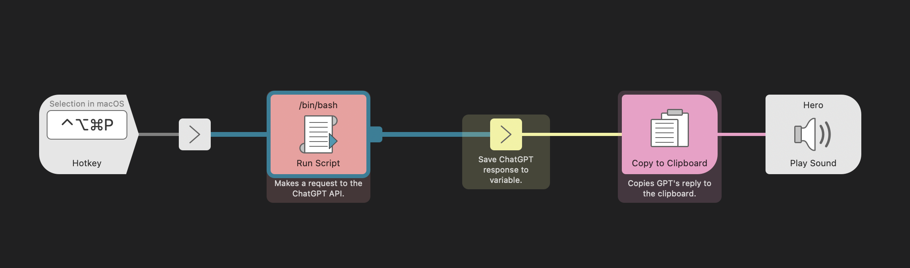

## Mac-Alfred-Logseq工作流

### 0. 运行环境

- MacOS
- Alfred5付费版
- Logseq
  
## 1. 使用场景说明：  

- 例子1：考试准备--需要制作对应的知识卡片并自动抠成填空题，存放在Logseq的Flashcards里面
  工作流：选中知识点→快捷键→程序读取剪贴板→生成卡片内容→输出到剪贴板→写入Logseq  

- 例子2：任务分解--将一段工作任务安排自动拆分成多个细分任务并按Logseq的格式返回
  工作流：选中工作描述→快捷键→程序读取剪贴板→生成分解任务内容→输出到剪贴板→写入Logseq  

- 例子3：公文写作--将一段文字转换为公文风格
  工作流：选中文字→快捷键→程序读取剪贴板→生成公文内容→输出到剪贴板  

## 2. 运作方式

Alfred工作流的思路非常简单，先是触发，然后是从你的电脑上获取输入，中间经过py处理，再返回输出。输入和输出一般直接存放于粘贴板是最为轻松的，而触发相对于快捷键而言更好的选择是弹出框。因此，如果你比较擅长记忆快捷键，可选快捷键，否则通过弹出框来输入会更合适。下面我以自己一个工作流为例进一步说明：

首先我使用的是Alfred5付费版，以及配合本地链式笔记Logseq，这些工具的使用本身可能是有一定门槛的，但大家可以根据实际情况进行一定的调整。比如说把Alfred换成popclip，Logseq换成Ob或自带note等。  

关键是中间的处理过程。因为Alfred不能直接调用python，因此使用了一个shell脚本来调用python，这样也比较方便后续单源测试：  
```query=$1
  OLD_IFS="$IFS"
  IFS=","
  
  argvs=($query)
  echo "参数调试:"${argvs} >> /yourpath/alfred-workflow/run.log
  
  cd /yourpath/alfred-workflow
  
  /your-conda-path/envs/311/bin/python /yourpath/alfred-workflow/text_chat_main.py ${argvs}
``` 
Python程序请查看[text_chat_main](./text_chat_main_share.py)

使用一个相同路径下的[templates.json](./templates/templates.json)文件存放分类，但这里自动模版判断的效果还不太好，里面的内容是：  
  `{  
      "planner":"任务规划:输入文本通常较短,并且明显具备事务属性",  
      "formalRewrte":"公文写作:输入文本较长,并且多为口语化表达",  
      "arguement":"角色辩论:输入文本较短,涉及一些需要讨论的问题",  
      "experts":"专家团:输入文本较短,涉及一些需要解决的较为专业的问题",  
      "cardgen":"知识卡片:输入文本较长,偏向陈述概念、解释概念;又或是一道考试题目"  
  }`  

你可以修改为自己的分类。每一个分类在`./templates`里面有对应prompt的md文件  

## 3. 工作流的缺点

- 目前让GPT自行判断选用哪个模版的准确率不高，可能会造成麻烦，但过多的操作也不利于体验和模板拓展，还没想到如何继续优化
- 工作流只支持一次性对话可解决的场景，多次对话还是需要使用对话框形式（就没太多必要专门做了）
- 整体玩法依赖组件多且复杂，需要用户自行操作的步骤太多，门槛高
